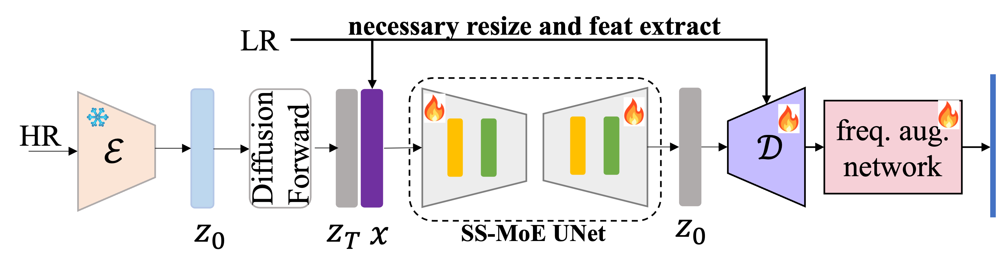
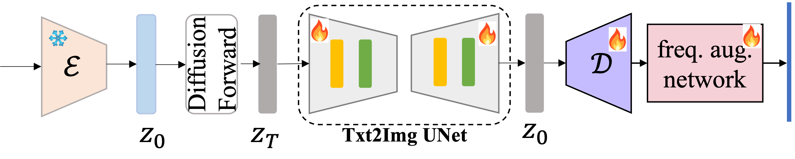
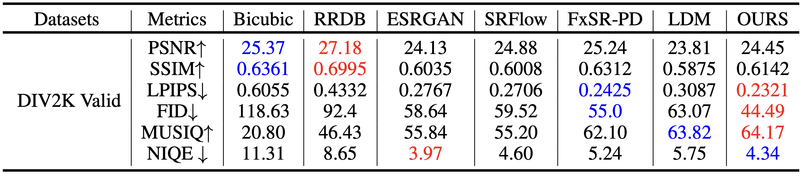

## [IMAGE SUPER-RESOLUTION VIA LATENT DIFFUSION: A SAMPLING-SPACE MIXTURE OF EXPERTS AND FREQUENCY-AUGMENTED DECODER APPROACH](https://arxiv.org/abs/2310.12004)

### OverView
The recent use of diffusion prior, enhanced by pre-trained text-image models, has markedly elevated the performance of image super-resolution (SR). 
In this project, we propose Frequency-Augmented VAE(FA_VAE), a frequency compensation module that enhances the frequency components and thus alleviates the reconstruction distortion caused by compression of latent space. **As FA_VAE is a stand-alone module, we also apply it to Image Reconstruction and Text-to-Image Generation and show examples in the repo.** In addition, we propose to use Sample-Space Mixture of Experts (SS-MoE) to achieve more powerful latent-based SR, which steadily improves the capacity of the model without a significant increase in inference costs. 


<p align="center">
    
</p>


### Dependencies and Installation
```
# git clone this repository
git clone https://github.com/tencent-ailab/Frequency_Aug_VAE_MoESR.git
cd MOE_SR

# Create a conda environment and activate it
conda env create --file my_environment.yaml
conda activate moe_sr

# Install xformers(optionally)
conda install xformers -c xformers/label/dev

# Install taming
pip install -e git+https://github.com/CompVis/taming-transformers.git@master#egg=taming-transformers
pip install -e .

```


## <a name="inference"></a>Inference

### Super Resolution

#### 8x SR

Download [model_stage{x}.ckpt](https://huggingface.co/amandaa/moe_sr/tree/main/Unet) and [vq-f4/fa_vae.pth](https://huggingface.co/amandaa/moe_sr/tree/main/first_stage_models/vq-f4) to `sr_8x_inf/models` and run the following command.

```shell
cd sr_8x_inf
sh inf_moe_8x.sh
```

### Txt2Img with FA_VAE

Latent-based Text-to-Image Generation(eg. SD1.5) also suffers from VAE's reconstruction accuracy, so the FA_VAE we proposed in SR can also be useful. We customize and train a FA_VAE for SD1.5. To be specific, lr input and lr-conditioned fuse layers are removed, as shown in the following figure. 

For practice, the only thing we need to do is to replace the original decoder with FA_VAE decoder. Download SD1.5 base models(eg. [realv](https://huggingface.co/SG161222/Realistic_Vision_V5.1_noVAE/tree/main)) and [kl-f8/fa_vae.pth](https://huggingface.co/amandaa/moe_sr/tree/main/first_stage_models/kl-f8) and set path in [get latent.py]() and [decode.py](), then run the following command.

<p align="center">
    
</p>

```shell
cd vae_txt2img_inf
# get diffusion latent
python3 get_latent.py
# decode to get images
python3 decode.py
```

## Reuslts
### 8x SR

**Quality Result**
<p align="center">
    
</p>

**Quantity Result**
<p align="center">
    
</p>


### Image Rescontruction with FA_VAE
Benefiting from the frequency-augmented decoder, it can be seen that distortion, especially face distortion, can be fixed mostly when comparing the updated VAE and SD1.5's original VAE. We evaluate the reconstruction performance on coco val 2017 and a private dataset that consists of 1000 high-quality images collected from the Internet. The evaluation tool is from [IQA-PyTorch](https://github.com/chaofengc/IQA-PyTorch).

**Quality Result**
<p align="center">
    
</p>

**Quantity Result**

**COCO 2017 (256x256, val, 5000 images)**

|  Model  | psnr  |  ssim   | lpips  |  fid   |
| ---- | ----  |  ----  | ----  |  ----  |
|  sd15 original  | 25.40 |  0.7418  | 0.0746 | 17.66 |
|  ours  |  26.04 | 0.7576  | 0.0702 | 16.12  |


**Private test set (256x256, 1000 images)**

|  Model  | psnr  |  ssim   | lpips  |  fid   |
| ---- | ----  |  ----  | ----  |  ----  |
|  sd15 original  | 27.64 |  0.8376  | 0.0524 | 19.62 |
|  ours  | 28.50 | 0.8563 | 0.0424 | 15.71 |


### Txt2Img with FA_VAE
Furthermore, we validate the effectiveness of FA_VAE on Text-to-Image Generation. As shown in the figure, it can also restore the distortion compared with the original VAE. Note that, we only replace the SD1.5's decoder with FA_VAE, which means it is compatible with all SD1.5 base models. 

<p align="center">
    
</p>

## Citation

Please cite us if our work is useful for your research.
    @inproceedings{luo2023Image,
        author = {Luo, Feng and Xiang, Jinxi and Zhang, Jun and Han, Xiao and Yang, Wei},
        title = {Image Super-resolution via Latent Diffusion: a Sampling-space Mixture of Experts and Frequency-augmented Decoder Approach},
        booktitle = {arXiv preprint arXiv:2310.12004},
        year = {2023}
    }


## License

This project is released under the [Apache 2.0 license](LICENSE).

## Acknowledgement

This project is based on [StableSR](https://github.com/IceClear/StableSR), [Latent Diffusion](https://github.com/CompVis/latent-diffusion) and [BasicSR](https://github.com/XPixelGroup/BasicSR). Thanks for their awesome work.

## Contact

If you have any questions, please feel free to contact with me at amandaaluo@tencent.com.